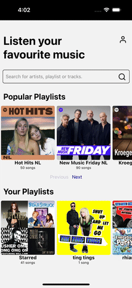

# Spotify Mini Client - React Native

## Overview

This project is a mini Spotify client built using **React Native** and **TypeScript**. The application interacts with the **Spotify Web API** to fetch playlists, display track details, and provide filtering and sorting functionalities. The app is designed to demonstrate API integration, state management with hooks, and UI development without utilizing an external UI component libraries.

Additionally, a **caching algorithm** has been implemented to optimize API calls, enhancing performance and minimizing redundant requests.

## Features

### 1. Browse Playlists

- Fetches Spotify playlists using the **Spotify Web API**.
- Includes popular playlists and a mock user's playlist (mock user: `taylorswift`) to demonstrate personalization.
- Each playlist displays its title and cover art.
- Allows navigation to the **Playlist Details** screen to view track information.

### 2. View Playlist Tracks

- Displays tracks in the selected playlist.
- Each track shows its name, artist(s), and album art.
- Utilizes a vertical FlatList for smooth scrolling and an intuitive user experience.

### 3. Filter Tracks

- A **real-time search bar** allows users to filter tracks by track name or artist.
- The filter updates the track list without additional API calls, enhancing speed and responsiveness.

### 4. Search Functionality

#### Main Page

- The search bar on the main page enables users to search across:
  - **Tracks**: Find specific tracks by name.
  - **Artists**: Locate tracks by specific artists.
  - **Playlists**: Search for playlists containing the specified tracks or artists.

#### Detail Page

- The search bar on the Playlist Details screen allows users to filter tracks within the selected playlist based on:
  - **Track Name**: Find specific tracks by name.
  - **Artist Name**: Locate tracks by the artist’s name.

### 5. Sorting Functionality

- Users can sort tracks in ascending or descending order by:
  - **Track Name (A-Z or Z-A)**
  - **Artist Name (A-Z or Z-A)**

### 6. Modularity

- **Component-Based Structure**: The project follows a component-based architecture to ensure clean and maintainable code. Each feature or UI element is encapsulated in its own component, promoting reusability and separation of concerns.

### 7. Caching Algorithm (Bonus)

- A caching mechanism has been implemented to minimize unnecessary API requests and optimize data retrieval.

## TODOs

- **Add Unit Tests**: Implement unit tests to ensure reliability and catch potential issues early.

## Screen Record

  

## ScreenShots

  
  
  
  
